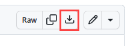
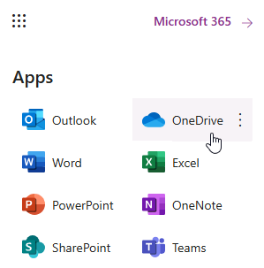
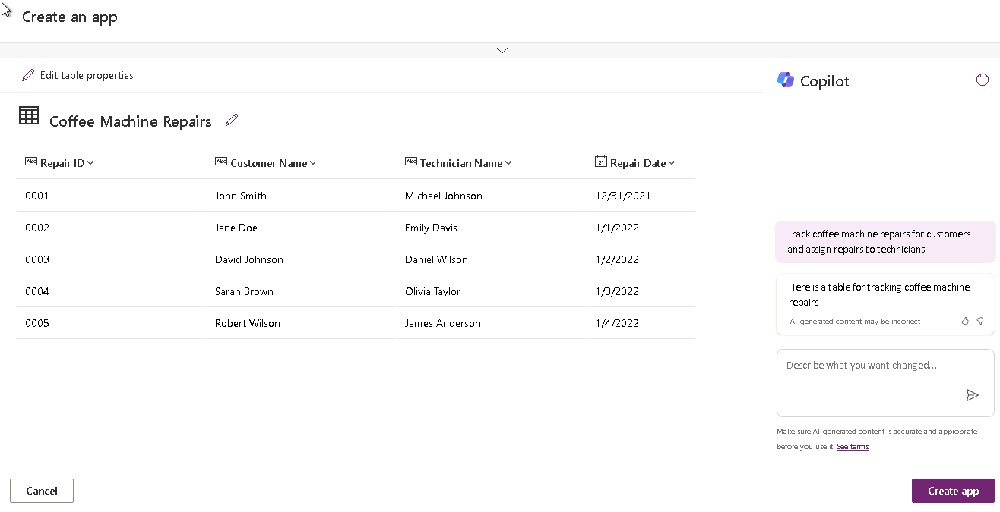

---
lab:
  title: 实验室 1：从数据创建画布应用
  module: 'Module 1: Get started with Power Apps canvas apps'
---

# 练习实验室 1 - 从数据创建画布应用

在本实验室中，你将从现有数据源设计和生成画布应用。

## 要学习的知识

- 如何使用 CoPilot 从数据创建 Power Apps 画布应用
- 如何使用 OneDrive for Business 作为数据源连接到 Excel

## 概要实验室步骤

- 创建三屏画布应用
- 测试应用
- 使用 CoPilot 创建画布应用
  
## 先决条件

- 必须已完成**实验室 0：验证实验室环境**

## 详细步骤

## 练习 1 - 获取数据

### 任务 1.1 - 下载 Excel 电子表格

1. 导航到 CoffeeMachineData.xlsx。

1. 选择“原始文件”按钮以下载 Excel 工作簿****。

    

### 任务 1.2 上传到 OneDrive for Business

1. 在 [Power Apps 创建者门户](https://make.powerapps.com)中，选择浏览器窗口左上角的“应用启动器”，然后选择“OneDrive”********。

    

1. 选择“OneDrive 已准备就绪”****。

1. 依次选择“+ 新增”、“文件上传”********。

    

1. 浏览到“下载”并选 CoffeeMachineData.xlsx 文件，然后选择“打开”****。

1. 选择“我的文件”并验证是否已上传 CoffeeMachineData.xlsx****。

## 练习 2 - 生成三屏画布应用

### 任务 2.1 - 创建应用

1. 导航到 Power Apps 创建者门户 <https://make.powerapps.com>。

1. 确保你位于“Dev One”环境中。****

1. 从左侧菜单中选择“+ 创建”选项卡。****

1. 选择“从”下的“Excel”磁贴********。

    

1. 选择“+ 新建连接”****

1. 选择“OneDrive for Business”，选择“创建”，使用租户凭据登录，然后选择“允许访问”************。

1. 在“选择 Excel 文件”下，找到并选择“CoffeeMachineData.xlsx”Excel 文件****。

1. 在“选择表格”下，选择“CoffeeMachines”****。

1. 选择“连接” 。

1. 等待生成应用。

    

1. 如果显示“**欢迎使用 Power Apps Studio**”弹出对话框，请选择“**不再向我显示此信息**”，然后选择“**跳过**”。

1. 选择 Power Apps Studio 右上角的“保存”，输入 `Coffee Machines App` 然后选择“保存”********。

### 任务 2.2 - 测试应用

1. 选择 Power Apps Studio 右上角的“预览应用”图标****。

1. 选择库中的任何计算机。 这将导航到“详细信息”屏幕，

1. 选择应用右上角的“编辑”图标****。 这将打开“编辑”屏幕。

1. 更改“**计算机价格**”并选择应用右上角的“**提交项目**”勾号图标。

1. 选择应用左上角的 < 图标****。

1. 选择应用右上角的 + 图标****。

1. 在“计算机 ID”中输入“`97`”****。

1. 在“计算机名称”中输入“`Demo Machine`”****。

1. 在“计算机价格”中输入“`999`”****。

1. 选择应用右上角的“**提交项目**”图标。

1. 在“搜索项”中输入“`Demo`”****。

1. 选择右上角的“X”以停止预览****。

1. 如果显示“**你知道吗？**”弹出对话框，选择“**不再显示此信息**”，然后选择“**确定**”。

1. 选择命令栏左上角的“**<- 返回**”按钮，然后选择“**退出**”以退出应用。

## 练习 3 - 使用 Copilot 生成画布应用

### 任务 3.1 - 创建应用

1. 导航到 Power Apps 创建者门户 <https://make.powerapps.com>。

1. 确保你位于“Dev One”环境中。****

1. 从左侧菜单中选择“主页”选项卡。****

1. 在“让我们生成一个应用。**** 它应该有哪些功能？”下输入 `Track coffee machine repairs for customers and assign repairs to technicians` 并选择箭头图标。

    

1. 查看表

    

1. 选择“创建应用”****

1. 等待生成应用。

    

1. 选择 Power Apps Studio 右上角的“**保存**”。

1. 选择命令栏左上角的“**<- 返回**”按钮，然后选择“**退出**”以退出应用。

1. 从 Power Apps 创建者门户的左侧菜单中选择“应用”选项卡****。
