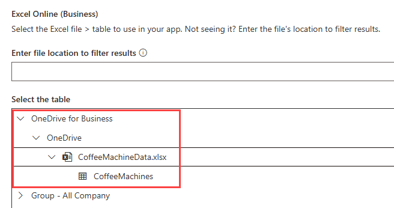
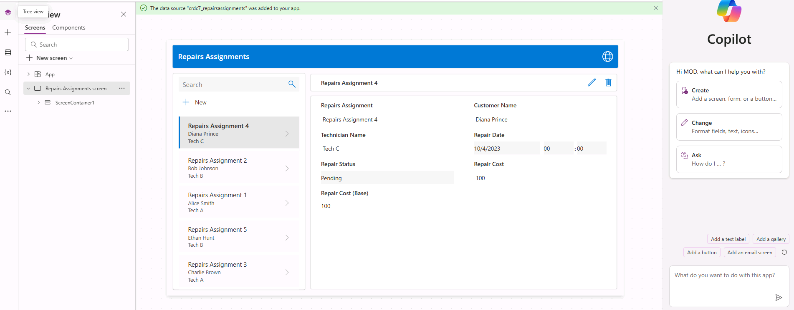

---
lab:
  title: 实验室 1：从数据创建画布应用
  module: 'Module 1: Get started with Power Apps canvas apps'
---

# 练习实验室 1 - 从数据创建画布应用

在本实验室中，你将从现有数据源设计和生成画布应用。

## 要学习的知识

- 如何使用 CoPilot 从数据创建 Power Apps 画布应用
- 如何使用 OneDrive for Business 作为数据源连接到 Excel

## 概要实验室步骤

- 根据数据创建画布应用
- 测试应用
- 使用 CoPilot 创建画布应用
  
## 先决条件

- 必须已完成**实验室 0：验证实验室环境**

## 详细步骤

## 练习 1 - 获取数据

### 任务 1.1 - 下载 Excel 电子表格

1. 导航到 CoffeeMachineData.xlsx。

1. 选择“原始文件”按钮以下载 Excel 工作簿****。

    

### 任务 1.2 上传到 OneDrive for Business

1. 在 [Power Apps 创建者门户](https://make.powerapps.com)中，选择浏览器窗口左上角的“应用启动器”，然后选择“OneDrive”********。

    

1. 如果显示弹出窗口，请选择“你的 OneDrive 已就绪”。****

1. 选择“**+ 创建或上传**”，然后选择“**文件上传**”

    

1. 浏览到“**下载**”文件夹，选择“**CoffeeMachineData.xlsx**”文件，然后选择“**打开**”。

1. 选择“我的文件”并验证是否已上传 CoffeeMachineData.xlsx****。

## 练习 2 – 根据数据生成画布应用

### 任务 2.1 - 创建应用

1. 导航到 Power Apps 创建者门户 <https://make.powerapps.com>。

1. 确保你位于“Dev One”环境中。****

1. 从左侧菜单中选择“**+ 创建**”选项卡。

1. 在“**创建应用**”下选择“**开始使用数据**”磁贴。

    

1. 在“**其他入门方法**”下选择“**连接外部数据**”磁贴。

    

1. 在“**选择要启动的数据集**”下，选择“**从 Excel 开始**”磁贴。

    

1. **Excel Online (Business)** 连接将在短暂延迟后自动创建。

1. 在“**选择表**”下展开“**OneDrive for Business**”。

1. 展开“**OneDrive**”。

1. 展开“**CoffeeMachineData.xlsx**”Excel 文件。

1. 选择“**CoffeeMachines**”表。

    

1. 选择“创建应用”  。

1. 如果显示“欢迎使用 Power Apps Studio”弹出对话框，请选择“不再向我显示此信息”，然后选择“跳过”。************

1. 等待生成应用。

    

1. 选择 Power Apps Studio 右上角的“保存”，输入 `Coffee Machines App` 然后选择“保存”********。

### 任务 2.2 - 测试应用

1. 在 Power Apps Studio 右上角选择“**预览应用 (F5)**”图标。

1. 选择库中的任何计算机。 这将在窗体中显示计算机的详细信息。

1. 选择应用右上角的“编辑”图标****。

1. 更改“**计算机价格**”，然后选择应用右上角的“**刻度**”图标。

1. 选择应用左上角的“**+ 新建**”图标。

1. 输入`abcde`作为计算机 ID。

1. 在“计算机名称”中输入“`Demo Machine`”****。

1. 在“计算机价格”中输入“`999`”****。

1. 选择应用右上角的“**刻度**”图标。

1. 选择右上角的“X”以停止预览****。

1. 如果显示“你是否知道？”弹出对话框，请选择“不再向我显示此信息”，然后选择“确定”。************

1. 选择命令栏左上角的“**<- 返回**”按钮，然后选择“**退出**”以退出应用。

## 练习 3 - 使用 Copilot 生成画布应用

### 任务 3.1 - 创建应用

1. 导航到 Power Apps 制作者门户 (`https://make.powerapps.com`)

1. 确保你位于 **Dev One** 环境中。

1. 从左侧菜单中选择“**+ 创建**”选项卡。

1. 在“**创建应用**”下选择“**开始使用 Copilot**”磁贴。

1. 在“**开始使用 Copilot**”下输入`Assign coffee repairs to technicians per customer request`。

    

1. 选择“**表选项**”图标，然后选择“**一个表**”。

    

1. 然后选择“生成”****。

    Copilot 将开始构建表格结构以支持应用程序。

    > **重要提示：** 使用生成式 AI 时，不会始终获得相同的确切结果。 你的表格可能与为其他学生创建的表格不完全匹配。

1. 选择表旁边的“**命令 (...)**”，然后选择“**查看数据**”。

    

1. 查看表

    

1. 对表格满意后，选择“**保存并打开应用**”按钮。

1. 如有必要，在“**已完成工作？**”屏幕上，选择“**不再询问我**”，然后选择“**保存并打开应用**”按钮。

1. 等待生成应用。

    

1. 选择 Power Apps Studio 右上角的“保存”，输入 `Coffee Machine Repairs App` 然后选择“保存”********。

1. 选择命令栏左上角的“<- 返回”按钮，然后选择“退出”以退出应用********。

1. 从 Power Apps 创建者门户的左侧菜单中选择“应用”选项卡****。
