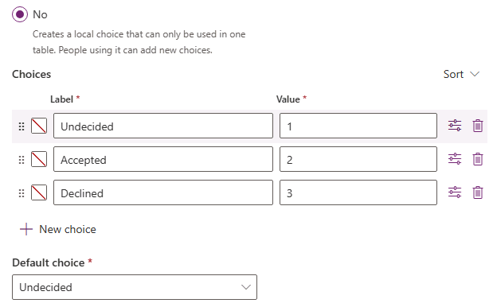

---
lab:
  title: 实验室 2：数据模型
  module: 'Module 2: Get started with Microsoft Dataverse'
---

# 练习实验室 2 – 数据模型

在此实验室中，你将创建 Dataverse 表和列。

## 要学习的知识

- 如何在 Microsoft Dataverse 中创建表和列
- 如何创建与查找列的关系

## 概要实验室步骤

- 创建自定义表
- 向表添加列
- 通过使用查找列创建与查找列的关系
  
## 先决条件

- 必须已完成**实验室 0：验证实验室环境**

## 详细步骤

## 练习 1 - 创建自定义表

### 任务 1.1 - 创建预订请求表

1. 导航到 Power Apps 制作者门户 (`https://make.powerapps.com`)

1. 确保你位于 **Dev One** 环境中。

1. 在左侧导航窗格中，选择**表**。

1. 选择“**+ 新建表**”，然后选择“**添加列和数据**”。

    

1. 选择“新建表”**** 旁边的“编辑表属性”**** 铅笔图标。

    

1. 在“显示名称”中输入 `Booking Request`。

1. 选择“保存”。

### 任务 1.2 - 主列

1. 选择“**新建列**”旁边的下拉列表插入符号，然后选择“**编辑列**”。

    

1. 在“显示名称”中输入 `Pet Name`。

1. 选择**更新**。

1. 选择**创建**。

### 任务 1.3 - 添加列

1. 在“预订请求列和数据”窗格中****，选择“+”**** 以添加新列。

    

1. 在“**新建列**”窗格中，输入或选择以下值：

   1. 显示名称：`Owner Name`
   1. 数据类型：**单行文本**
   1. Required:**需要业务**

    

1. 选择“保存”。

1. 在“预订请求列和数据”窗格中****，选择“+”**** 以添加新列。

1. 在“新建列”窗格中，输入或选择以下值****：

   1. 显示名称：`Owner Email`
   1. 数据类型：单行文本****
   1. 格式：**电子邮件**
   1. Required:需要业务****

1. 选择“保存”。

1. 在“预订请求列和数据”窗格中，选择“+”，然后在“新建列”窗格中输入或选择以下值************：

   1. 显示名称：`Start Date`
   1. 数据类型：**日期和时间**
   1. Required:需要业务****

1. 选择“保存”。

1. 在“预订请求列和数据”窗格中，选择“+”，然后在“新建列”窗格中输入或选择以下值************：

   1. 显示名称：`End Date`
   1. 数据类型：**日期和时间**
   1. Required:**可选**

1. 选择“保存”。

1. 在“预订请求列和数据”窗格中，选择“+”，然后在“新建列”窗格中输入或选择以下值************：

   1. 显示名称：`Cost`
   1. 数据类型：货币****
   1. Required:**可选**

1. 选择“保存”。

1. 在“预订请求列和数据”窗格中，选择“+”，然后在“新建列”窗格中输入或选择以下值************：

   1. 显示名称：`Notes`
   1. 数据类型：**多行文本**
   1. 格式：**Text**
   1. Required:**可选**

1. 选择“保存”。

### 任务 1.4 - 添加选择列

1. 在“预订请求列和数据”窗格中，选择“+”，然后在“新建列”窗格中输入或选择以下值************：

   1. 显示名称：`Decision`
   1. 数据类型：**选项**
   1. Required:**可选**

1. 对于“**与全局选项同步？**”，选择“**否**”

1. 对于“**标签**”，输入“`Undecided`”，对于“**值**”，则输入“`1`”。

1. 选择“**+ 新建选项**”，然后为“**标签**”输入“`Accepted`”，为“**值**”输入“`2`”。

1. 选择“+ 新建选择”，然后为“标签”输入“`Declined`”，为“值”输入“`3`”************。

1. 为“默认选择”选择“未决定”********。

    

1. 选择“保存”。

## 练习 2 - 创建关系

### 任务 2.1 - 创建查找列

1. 导航到 Power Apps 制作者门户 (`https://make.powerapps.com`)

1. 确保你位于 **Dev One** 环境中。

1. 在左侧导航窗格中，选择**表**。

1. 选择“预订请求”****。

1. 在“预订请求列和数据”窗格中，选择“+”，然后在“新建列”窗格中输入或选择以下值************：

   1. 显示名称：`Account`
   1. 数据类型：**查找**
   1. Required:**可选**
   1. 相关表：**帐户**

    

1. 选择“保存”。

## 练习 3 - 数据

### 任务 3.1 - 添加预订请求记录

1. 导航到 Power Apps Maker 门户 <https://make.powerapps.com>。

1. 确保你位于 **Dev One** 环境中。

1. 在左侧导航窗格中，选择**表**。

1. 选择“预订请求”****。

1. 在“预订请求列和数据****”窗格中，选择“编辑****”旁边的下拉插入符号，然后选择“在新建选项卡中编辑****”。

1. 输入或选择以下值：

   1. 宠物名称：`Fido`
   1. 所有者名称：`MOD Administrator`
   1. 所有者电子邮件：使用你的租户电子邮件
   1. 开始日期：明天****
   1. 结束日期：选取下周的日期****
   1. 成本：`1,000`
   1. 决策：已接受****

1. 选择“在下方插入列****”，然后输入或选择以下值：

   1. 宠物名称：`Tom`
   1. 所有者名称：`MOD Administrator`
   1. 所有者电子邮件：使用你的租户电子邮件
   1. 开始日期：选取下月的日期****
   1. 结束日期：选取开始日期之后的日期****
   1. 成本：`1,500`
   1. 决策：未定****

1. 选择“在下方插入列****”，然后输入或选择以下值：

   1. 宠物名称：`Jim`
   1. 所有者名称：`MOD Administrator`
   1. 所有者电子邮件：使用你的租户电子邮件
   1. 开始日期：**选择本月未来的日期**
   1. 结束日期：选取开始日期之后的日期****
   1. 成本：`250`
   1. 决策：已拒绝****

1. 关闭“编辑数据”选项卡。

