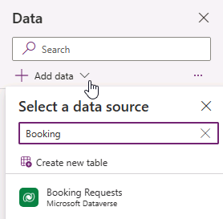
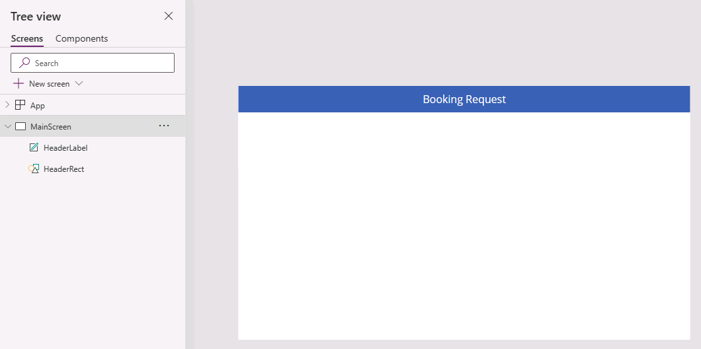
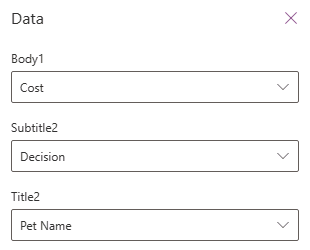

---
lab:
  title: 实验室 3：创建画布应用
  module: 'Module 3: Customize a canvas app in Power Apps'
---

# 练习实验室 3 - 创建画布应用

在本实验室中，你将从头开始设计和生成画布应用，添加数据源和库。

## 要学习的知识

- 如何使用链接到数据源的库创建画布应用
- 如何使用 Power Fx 公式设置字段格式

## 概要实验室步骤

- 从头开始创建画布应用
- 向应用添加数据源
- 向应用添加库
- 配置库中的字段
  
## 先决条件

- 必须已完成“**实验室 2：数据模型**

## 详细步骤

## 练习 1 - 创建画布应用

### 任务 1.1 - 创建应用

1. 导航到 Power Apps 制作者门户 (`https://make.powerapps.com`)

1. 确保你位于 **Dev One** 环境中。

1. 从左侧导航菜单中选择“+ 创建”选项卡****。

1. 在“**创建应用**”下选择“**开始使用空白画布**”磁贴。

1. 选择“**平板电脑尺寸**”。

1. 等待生成空白应用。

1. 选择 Power Apps Studio 右上角的“保存”，输入 `Booking Request app` 然后选择“保存”********。

### 任务 1.2 - 添加数据源

1. 在应用创作菜单中，选择**数据**。

    

1. 选择“添加数据”旁边的下拉插入符，然后在“搜索”中输入 `Booking`********。

    

1. 选择“预订请求”Microsoft Dataverse 表****。

### 任务 1.3 - 配置主屏幕

1. 在应用创作菜单中，选择“树状视图”****。

1. 在树状视图中选择“Screen1”，然后依次选择省略号 (...)、“重命名”************。

1. 输入 `MainScreen`。

1. 在应用创作菜单中，选择“插入(+)”****。

1. 选择“矩形”****。

1. 将矩形拖到屏幕左上角。

1. 在应用创作菜单中，选择“树状视图”****。

1. 将矩形重命名为 `HeaderRect`。

1. 按如下方式设置公式栏中矩形的属性：

   1. X=`0`
   1. Y=`0`
   1. Height=`80`
   1. Width=`Parent.Width`

1. 在应用创作菜单中，选择“插入(+)”****。

1. 选择**文本标签**。

1. 将标签拖到屏幕左上角。

1. 在应用创作菜单中，选择“树状视图”****。

1. 将标签重命名为 `HeaderLabel`。

1. 如下所示设置公式栏中标签的属性：

   1. X=`0`
   1. Y=`0`
   1. Height=`80`
   1. Width=`Parent.Width`
   1. Align=`Align.Center`
   1. Size=`24`
   1. Text=`"Booking Request"`
   1. Color=`Color.White`

    

1. 选择 Power Apps Studio 右上角的“保存”****。

### 任务 1.4 - 添加库

1. 在应用创作菜单中，选择“插入(+)”****。

1. 选择**垂直库**。

    

1. 选择数据源的“预订请求”****。

    

1. 在“属性”选项卡中，为“布局”选择“标题、副标题和正文”。************

1. 选择“字段”旁边的“已选择 7 个”。********

1. 为“正文1”选择“成本”********。

   > **备注：** 字段名称可能显示为带有前缀的架构名称，而不是显示名称。

1. 为“副标题2”选择“决策”********。

1. 为“标题2”选择“宠物名称”********。

    

1. 关闭**数据**窗格。

1. 在应用创作菜单中，选择“**树状视图**”。

1. 将库重命名为 `BookingRequestList`。

1. 如果出现建议弹出对话框，请选择“**取消**”。

1. 在公式栏中设置库的属性，如下所示：

   1. X=`0`
   1. Y=`80`
   1. Height=`575`
   1. Width=`250`

### 任务 1.5 - 设置货币字段的格式

1. 在应用创作菜单中，选择“树状视图”****。

1. 展开 BookingRequestList 库。****

1. 选择“正文1”。****

    

1. 将公式栏中的“文本”属性设置为公式****：

    ```powerappsfl
    Text(Value(ThisItem.Cost), "$#,##0.00")
    ```

1. 选择 Power Apps Studio 右上角的“**保存**”。

1. 选择命令栏左上角的“**<- 返回**”按钮，然后选择“**退出**”以退出应用。
