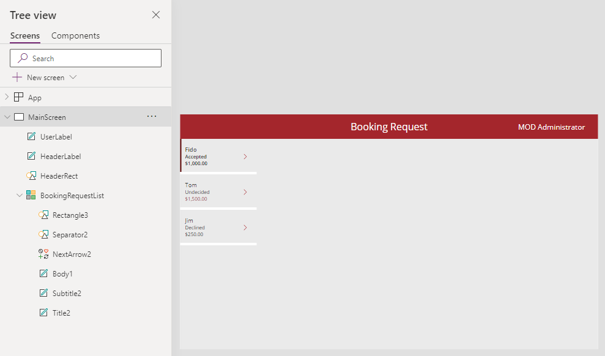

---
lab:
  title: 实验室 4：生成 UI
  module: 'Module 4: How to build the UI in a canvas app in Power Apps'
---

# 练习实验室 4 - 生成 UI

在此实验室中，你将更改应用中控件的颜色。

## 要学习的知识

- 如何使用主题
- 如何个性化应用

## 概要实验室步骤

- 选择主题
- 个性化设置
  
## 先决条件

- 必须已完成 **实验室 3：创建画布应用**

## 详细步骤

## 练习 1 - 主题

### 任务 1.1 - 编辑应用

1. 导航到 Power Apps Maker 门户 <https://make.powerapps.com>。

1. 确保你位于 **Dev One** 环境中。

1. 从左侧菜单中选择“**应用**”选项卡。

1. 选择“预订请求”应用****，选择“命令”（“...”****），然后选择“编辑”>“在新选项卡中编辑”****。

### 任务 1.2 - 选择主题

1. 在 Power Apps Studio 的操作栏中，选择“主题”****。

    

1. 选择“红色”主题****。

### 任务 1.3 - 品牌控件

1. 在应用创作菜单中，选择“树状视图”****。

1. 展开“BookingRequestList”库。****

1. 选择“NextArrow2”。****

1. 将公式栏中“NextArrow”的“Color”**** 属性设置为：

    ```powerappsfl
    RGBA(164, 38, 44, 1)
    ```

1. 选择“Body1”。****

1. 将公式栏中“Body”的“Color”**** 属性设置为：

    ```powerappsfl
    If(ThisItem.Cost > 1000, RGBA(164, 38, 44, 1), Color.Black)
    ```

1. 选择 Power Apps Studio 右上角的“保存”****。


## 练习 2 - 个性化

### 任务 2.1 - 添加用户标签

1. 在空白画布上库的外部选择，或者选择“MainScreen”。****

1. 在应用创作菜单中，选择“**插入 (+)**”。

1. 选择**文本标签**。

1. 将标签拖到屏幕右上角。

1. 在应用创作菜单中，选择“树状视图”****。

1. 将标签重命名为 `UserLabel`。

1. 如下所示设置公式栏中标签的属性：

   1. X=`1100`
   1. Y=`20`
   1. Height=`40`
   1. Width=`250`
   1. Align=`Align.Right`
   1. Size=`18`
   1. PaddingRight=`10`
   1. Color=`Color.White`
   1. Text=`User().FullName`

    

1. 选择 Power Apps Studio 右上角的“保存”****。

1. 选择命令栏左上角的“**<- 返回**”按钮，然后选择“**退出**”以退出应用。
