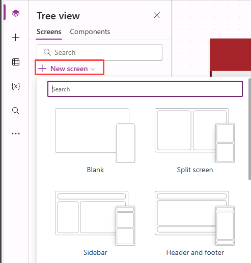
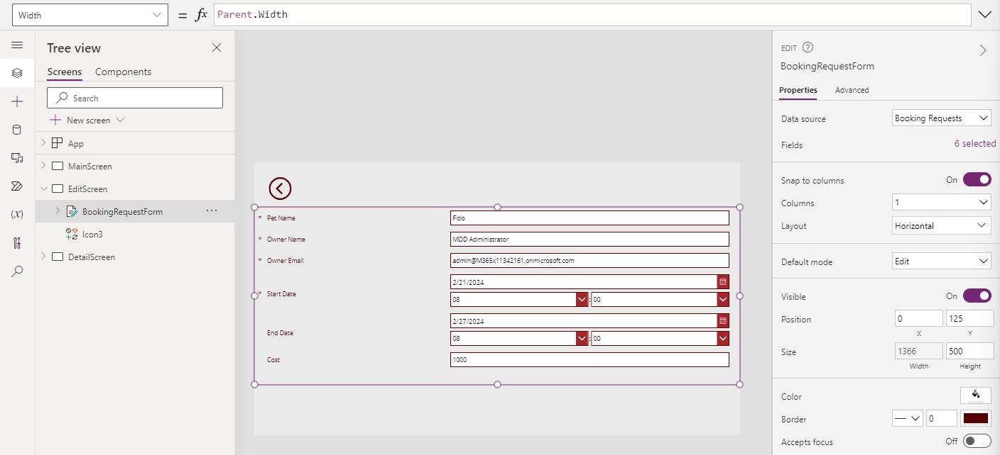

---
lab:
  title: 实验室 6：表单
  module: 'Module 6: Write data in a Power Apps canvas app'
---

# 练习实验室 6 – 表单

在此实验室中，你将使用表单在数据源中创建和编辑记录。

## 要学习的知识

- 如何添加屏幕
- 如何在屏幕之间导航
- 如何使用表单在数据源中创建记录
- 如何使用表单在数据源中编辑记录
- 如何从数据源中删除记录
- 如何将表单链接到库

## 概要实验室步骤

- 创建新屏幕
- 在库中选择记录时导航到屏幕
- 在屏幕之间导航
- 使用表单显示记录
- 删除记录
- 使用表单编辑记录
- 使用表单创建新记录
  
## 先决条件

- 必须已完成“**实验室 5：外部数据**”

## 详细步骤

## 练习 1 - 添加屏幕和导航

### 任务 1.1 - 编辑应用

1. 导航到 Power Apps 制作者门户 (`https://make.powerapps.com`)

1. 确保你位于 **Dev One** 环境中。

1. 从左侧导航菜单中选择“应用”选项卡。****

1. 选择 **“预订请求”应用**，选择“命令”（“**...**”），然后选择 **“编辑”>“在新选项卡中编辑”**。


### 任务 1.2 - 添加屏幕

1. 在应用创作菜单中，选择“**树状视图**”。

1. 在 Power Apps Studio 的操作栏中，选择“**新建屏幕**”。

    

1. 选择**空白**。

1. 将屏幕重命名为 `EditScreen`。

1. 在 Power Apps Studio 的操作栏中，选择“**新建屏幕**”。

1. 选择“**页眉和页脚**”。

1. 将屏幕重命名为 `DetailScreen`。


### 任务 1.3 - 添加导航

1. 在“树状视图”中****，展开“MainScreen”**** 中的“BookingRequestList”****。

1. 在“BookingRequestList”中选择“NextArrow”********。

1. 将公式栏中“NextArrow”的“OnSelect”**** 属性设置为：

    ```powerappsfl
    Collect(colRequests, ThisItem);Navigate(DetailScreen, ScreenTransition.Cover);
    ```

1. 选择 **EditScreen**。

1. 在应用创作菜单中，选择“**插入 (+)**”。

1. 展开“**图标**”。

1. 选择“**后退箭头**”。

1. 将图标的 **OnSelect** 属性设置为：

    ```powerappsfl
    Back()
    ```

1. 在“**树视图**”中，选择图标并选择“命令”（**...**），然后选择“**复制**”。

1. 展开 **DetailScreen**。

1. 展开 **ScreenContainer**。

1. 选择 **HeaderContainer**，然后选择“命令”（**...**），然后选择“**粘贴**”。


## 练习 2 - 详细信息屏幕

### 任务 2.1 - 添加显示格式

1. 在应用创作菜单中，选择“**树状视图**”。

1. 展开 **DetailScreen**。

1. 展开 ScreenContainer1****。

1. 选择 MainContainer1****。

1. 在应用创作菜单中，选择“**插入 (+)**”。

1. 展开“**输入**”。

1. 选择“**显示格式**”。

    

1. 在 FormViewer 的属性中，选择“**数据源**”的“**预订请求**”。

1. 选择“**字段**”旁边的“**已选择 2 个**”

    

1. 通过选择字段旁边的省略号（“...”****），然后选择“移除”**** 来移除“创建时间”****。

1. 选择“**+添加字段**”并选择以下字段：

   1. 成本
   1. 决策
   1. 结束日期
   1. 所有者电子邮件
   1. 所有者名称
   1. 开始日期

    

1. 选择 **添加** 。

1. 将字段拖动为以下顺序：

   1. 宠物名称
   1. 所有者名称
   1. 所有者电子邮件
   1. 开始日期
   1. 结束日期
   1. 决策
   1. 成本

    

1. **关闭**“**字段**”窗格。

1. 将公式栏中窗体查看器控件的“Item”**** 属性设置为：

    ```powerappsfl
    BookingRequestList.Selected
    ```

### 任务 2.2 - 添加标签

1. 在应用创作菜单中，选择“**树状视图**”。

1. 展开 **DetailScreen**。

1. 展开 ScreenContainer1****。

1. 选择 FooterContainer1****。

1. 在页脚容器中选择 **+**。

    

1. 选择“**文本标签**”

1. 将标签的“**文本**”属性设置为：

    ```powerappsfl
    BookingRequestList.Selected.'Pet Name'
    ```

### 任务 2.3 - 添加删除按钮

1. 在应用创作菜单中，选择“**树状视图**”。

1. 展开 **DetailScreen**。

1. 展开 ScreenContainer1****。

1. 选择 FooterContainer1****。

1. 在应用创作菜单中，选择“**插入 (+)**”。

1. 选择**按钮**。

1. 在应用创作菜单中，选择“**树状视图**”。

1. 将按钮重命名为“`Deletebtn`”。

1. 将按钮的“**文本**”属性设置为：

    ```powerappsfl
    "Delete"
    ```

1. 将按钮的 **OnSelect** 属性设置为：

    ```powerappsfl
    Remove('Booking Requests', BookingRequestList.Selected); Back();
    ```

## 练习 3 - 编辑屏幕

### 任务 3.1 - 添加编辑表单

1. 在应用创作菜单中，选择“**树状视图**”。

1. 选择 **EditScreen**。

1. 在应用创作菜单中，选择“**插入 (+)**”。

1. 选择“**编辑表单**”。

1. 在 FormViewer 的属性中，选择“**数据源**”的“**预订请求**”。

1. 选择“**字段**”旁边的“**已选择 2 个**”

1. 通过选择字段旁边的省略号（“...”****），然后选择“移除”**** 来移除“创建时间”****。

1. 选择“**+添加字段**”并选择以下字段：

   1. 成本
   1. 结束日期
   1. 所有者电子邮件
   1. 所有者名称
   1. 开始日期

1. 选择 **添加** 。

1. 将字段拖动为以下顺序：

   1. 宠物名称
   1. 所有者名称
   1. 所有者电子邮件
   1. 开始日期
   1. 结束日期
   1. 成本

1. **关闭**“**字段**”窗格。

1. 将表单控件的“**项**”属性设置为：

    ```powerappsfl
    BookingRequestList.Selected
    ```

1. 在应用创作菜单中，选择“**树状视图**”。

1. 将表单重命名为“`BookingRequestForm`”。

1. 按如下所示设置表单的属性：

   1. X=`0`
   1. Y=`125`
   1. Height=`500`
   1. Width=`Parent.Width`
   1. Columns=`1`
   1. Layout=`Horizontal`

    


### 任务 3.2 - 添加“提交”按钮

1. 在应用创作菜单中，选择“**树状视图**”。

1. 选择 **EditScreen**。

1. 在应用创作菜单中，选择“**插入 (+)**”。

1. 选择**按钮**。

1. 将按钮拖到表单下方。

1. 在应用创作菜单中，选择“**树状视图**”。

1. 将按钮重命名为“`Submitbtn`”。

1. 将按钮的“**文本**”属性设置为：

    ```powerappsfl
    "Submit"
    ```

1. 将按钮的 **OnSelect** 属性设置为：

    ```powerappsfl
    SubmitForm(BookingRequestForm)
    ```

1. 选择 **BookingRequestForm**。

1. 将窗体的 OnSuccess**** 属性设置为：

    ```powerappsfl
    Navigate(MainScreen, ScreenTransition.UnCover)
    ```

### 任务 3.3 - 将导航添加到编辑屏幕

1. 在应用创作菜单中，选择“**树状视图**”。

1. 展开 **DetailScreen**。

1. 展开 **ScreenContainer**。

1. 选择 **HeaderContainer**。

1. 在应用创作菜单中，选择“**插入 (+)**”。

1. 展开“**图标**”。

1. 选择“编辑”  。

1. 在应用创作菜单中，选择“**树状视图**”。

1. 将图标重命名为“`EditIcon`”。

1. 将图标的 **OnSelect** 属性设置为：

    ```powerappsfl
    Navigate(EditScreen, ScreenTransition.Cover)
    ```

### 任务 3.4 - 新建记录

1. 在应用创作菜单中，选择“**树状视图**”。

1. 选择 **MainScreen**。

1. 在应用创作菜单中，选择“**插入 (+)**”。

1. 展开“**图标**”。

1. 选择 **添加** 。

1. 在应用创作菜单中，选择“**树状视图**”。

1. 将图标重命名为“`NewIcon`”。

1. 按如下所示设置图标的属性：

   1. X=`0`
   1. Y=`0`
   1. Height=`80`
   1. Width=`80`
   1. Color=`Color.White`

1. 将图标的 **OnSelect** 属性设置为：

    ```powerappsfl
    NewForm(BookingRequestForm);Navigate(EditScreen, ScreenTransition.Cover)
    ```

1. 选择 Power Apps Studio 右上角的“**保存**”。

1. 选择命令栏左上角的“**<- 返回**”按钮，然后选择“**退出**”以退出应用。

