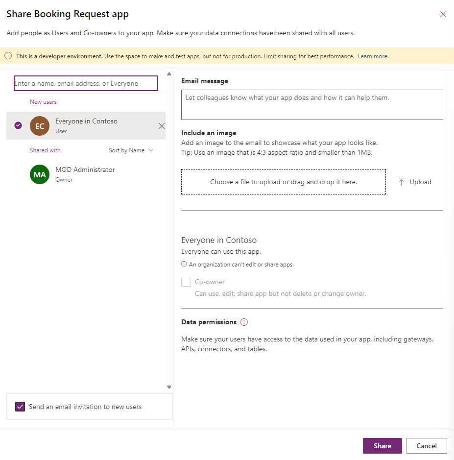
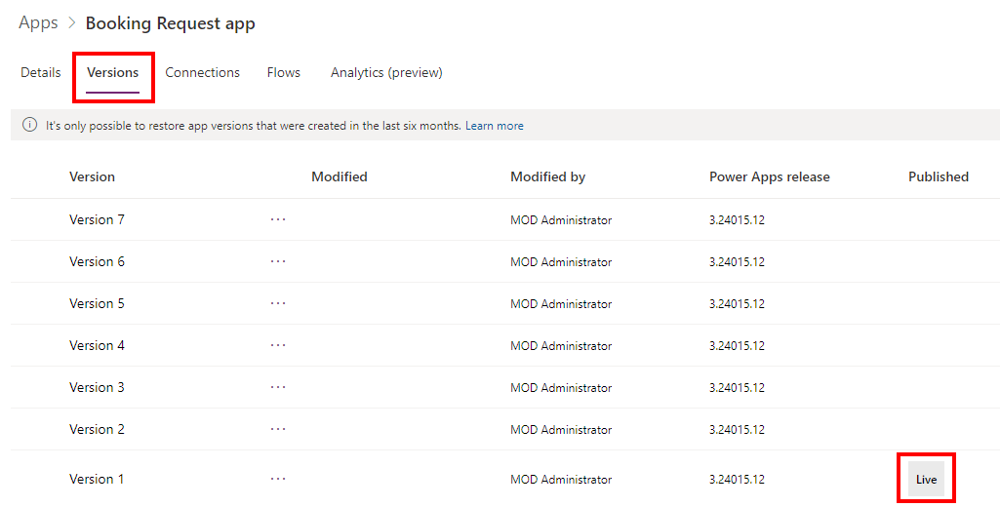
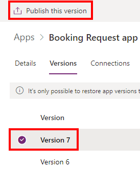

---
lab:
  title: 实验室 7：管理画布应用
  module: 'Module 7: Publish, share, and maintain a canvas app'
---

# 练习实验室 7 - 管理画布应用

在此实验室中，你将管理画布应用。

## 要学习的知识

- 如何共享画布应用
- 如何管理画布应用版本
- 如何发布画布应用
- 如何导出画布应用

## 概要实验室步骤

- 共享画布应用
- 查看画布应用版本
- 发布画布应用
- 导出画布应用
  
## 先决条件

- 必须已完成“**实验室 2：表单**”

## 详细步骤

## 练习 1 - 管理

### 任务 1.1 - 共享预订请求应用

1. 导航到 Power Apps 制作者门户 (`https://make.powerapps.com`)

1. 确保你位于 **Dev One** 环境中。

1. 从左侧导航菜单中选择“应用”选项卡****。

1. 选择 **“预订请求”应用**，选择“命令”（**...**），然后选择“**共享**”。

    

1. 在“共享”窗格中，输入 `Everyone` 并选择“**Contoso 中的每个人**”。

    

1. 选择**共享**。

1. **关闭**“共享应用”窗格。

### 任务 1.2 - 发布预订请求应用

1. 选择 **“预订请求”应用**，选择“命令”（**...**），然后选择“**详细信息**”。

1. 选择**版本**选项卡。

    

1. 选择“最高版本”。

    

1. 选择**发布此版本**。

1. 再次选择“**发布此版本**”。

## 练习 2 – 导出

### 任务 2.1 - 导出预订请求应用

1. 导航到 Power Apps 制作者门户 (`https://make.powerapps.com`)

1. 确保你位于 **Dev One** 环境中。

1. 从左侧导航菜单中选择“应用”选项卡****。

1. 选择 **“预订请求”应用**，选择“命令”（**...**），然后选择“**导出包**”。

1. 在“名称”中输入 `Booking Request app` 。

1. 在“**导出设置**”下选择“**更新**”。

1. 选择“**新建**”，并选择“**保存**”。

    

1. 选择“导出”。

1. 等待创建并下载包。 这会在 Downloads 文件夹中创建 zip 文件****。

### 任务 2.2 - 在本地保存应用

1. 从左侧导航菜单中选择“应用”选项卡****。

1. 选择 **“预订请求”应用**，选择“命令”（“**...**”），然后选择 **“编辑”>“在新选项卡中编辑”**。

1. 选择 Power Apps Studio 右上角“保存****”旁边的下拉插入符号。

1. 选择“**下载副本**”。

1. 选择“下载”  。  这会在 Downloads 文件夹中创建 .msapp 文件****。

1. 选择命令栏左上角的“**<- 返回**”按钮，然后选择“**退出**”以退出应用。

